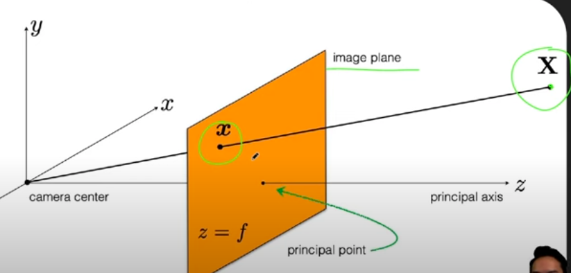
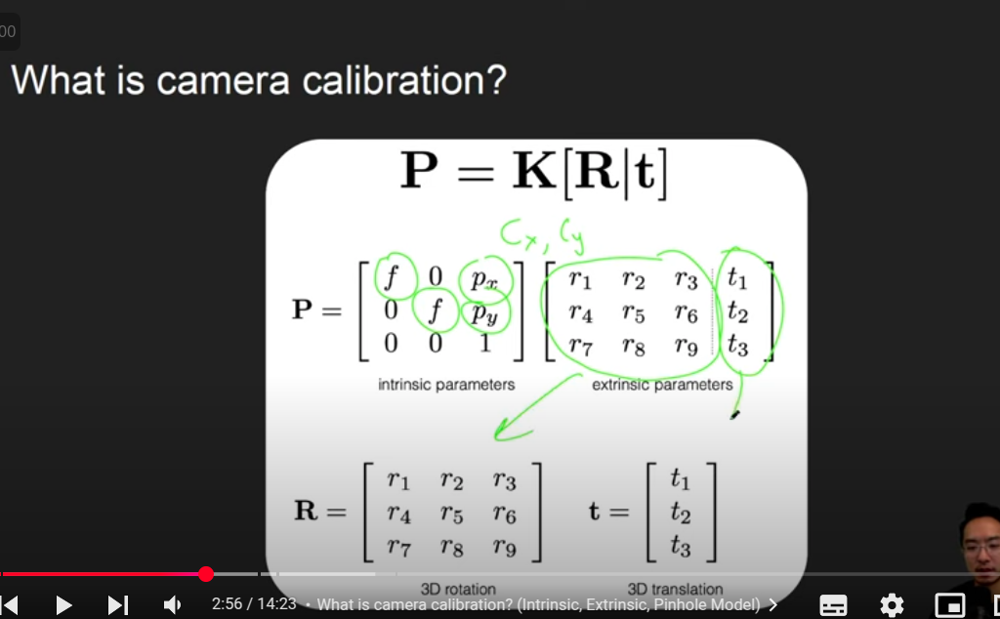
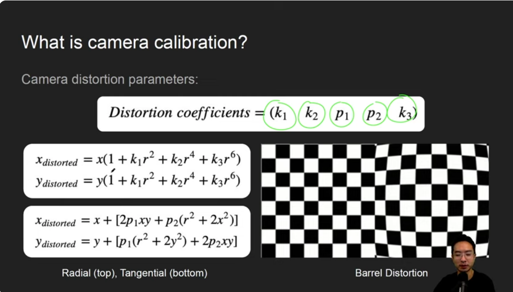
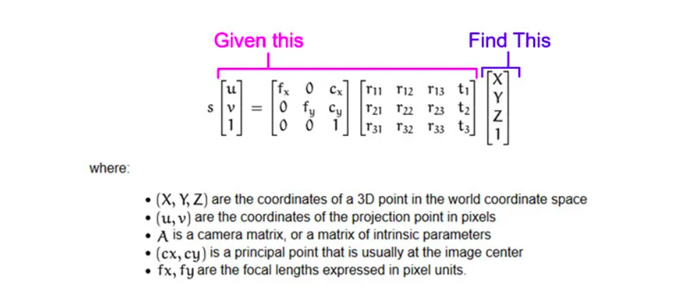

WT: 2cm by 2cm
Tile: 12cm by 12cm

Problema: Pose estimation
position and orientation
temos projeção (resultado de transformação (matrizes) de rotação/translação) -> queremos achar possível posição original que dado transformações minimiza erro com prejeção que temos

- solvepnp iterative do cv2 é famoso

https://www.youtube.com/@kevinwoodrobotics

Camera Calibration: obtain the camera parameters

- Intrinsics -> found during calibration
  - Focal length (f)
  - Principal point (cx, cy) -> center of image
  - Distortion: k1, k2, p1, p2, k3
- Extrinsics -> calculated by solvePnP (give several points of the object and their 2D projection; perspective n-point problem, ex: P3P é com n=3)
  - Rotation: R - matrix 3x3
  - Translation: T - matrix 3x1

Understand camera model for calibration:

- X é o ponto real que queremos determinar, temos a projeção dele na câmera

- Camera matrix varia dimensões, 1 é filler para esse tipo de situação

- Depending on coefficients, there are different types of distorcion

