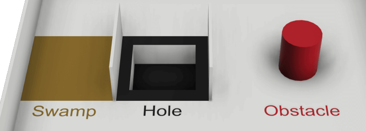
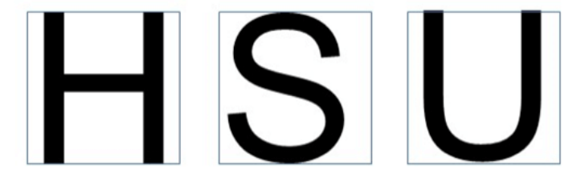
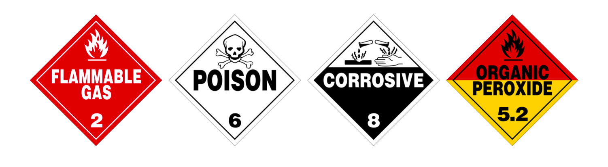
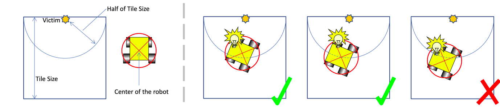

# Regras LARC simulation 2024

Forum com atualizações de regras Larc/robocup junior, precisa olhar: https://junior.forum.robocup.org
Regras gerais: https://junior.robocup.org/robocupjunior-general-rules/

O robô começa de um dos tiles da área 1 mais externos
Caminhos para o robô devem ter pelo menos a largura do robô e podem abrir em bifurcações mais amplas

## Sobre o evento / regras gerais

Mentors nao podem ficar na area do estudante nem participar/fazer construcao do robo (estudantes tem também que se auto-liderarem durante horas da competição); familiares também não

* The organizers will run the games on a server-client model and prepare one RJ-45 socket for teams to connect to the game server. Teams must prepare a computer and an ethernet cable to run the prepared programs

### Sobre o time

1. Deve ter entre 2 e 4 pessoas, cada um com a idade correta determinada em RoboCupJunior General Rules
2. Cada estudante só pode se increver em um time entre todas RoboCupJunior leagues/sub-leagues e o time só pode participar de uma RoboCupJunior league/sub-league
3. Cada membro deve explicar seu trabalho e ter uma specific technical role

#### Pessoas do time (item 4.2)

* Time deve designar um membro como "captain" e outro "co-captain", somente eles podem acessar as arenas da competição onde os ambientes de simulação estão localizados, ao menos que juíz defina outra coisa
* O juíz performa todas operações do ambiente de simulação, como carregar programas e operar LoP
* Ningúem pode intencionalmente tocar nos ambientes de simulação durante um jogo

### Inspeção / documentos

1. Para garantir que o trabalho é dos alunos, eles deverão explicar a operação do programa deles
2. Estudantes serão perguntados dos seus esforços de preparação. E o RoboCupJunior Rescue Committee pode pedir para eles responderem pesquisas e participarem de entrevidas gravadas para fins de pesquisa
3. Times terão que responder online um forms antes da competição para os juízes conseguirem preparar as entrevistas. O committee vai pelo menos 4 semanas antes da competição dar instruções de como mandar os forms.
4. Cada equipe vai mandar TDP (Technical Description Paper) antes da competição que é documento público compartilhado com a comunidade. Template e rubrics tão no RoboCupJunior Official website
5. Equipes também devem mandar código antes da competição. Que serão compartilhados após a competição.
6. Equipes devem mandar o Engineering Journal antes da competição, que só será compartilhado no RobocupJunior forum se permitido pelo time (encorajam que publique). Padrão de formatação e rubrics tão disponíveis em RoboCupJunior Official website.
7. Equipes devem enviar pôster(o Poster) em arquivo antes da competição e levar um físico para lá. Esse cartaz é um documento público compartilhado com a comunidade durante a sessão de apresentação dos pôsteres. Modelo e rúbricas tão no site da RobocupJunior
8. Deadline para os documentos é 3 semanas antes do primeiro dia de competição. Padrões aqui: https://rescue.rcj.cloud/documents

* Código e outros documentos devem ser mandados antes das datas definidas pelo committee (organizadores compartilhão detalhes no Forum)

### Proibições

* Modificações devem ser feitas a tempo no calendário do torneio e times não podem adiar partidas enquanto modificam algo
* Softwares feitos para fazer tarefas primárias específicas da RoboCupJunior Rescue como, por exemplo, reconhecimento de letras (como Tesseract e EasyOCR), são proibidos
* Violação de regra é penalizada com desclassificação da competição ou jogo ou pode ser descontado alguns pontos (de acordo com decisão do juíz, oficiais e committee)

## Areas

Areas 1 to 3 consist of a tile-based system maze-like layout. Area 4 (optional area) is not tile-based, and teams are encouraged to explore interesting simultaneous localization and mapping algorithms.
Areas sao separadas por tile de largura fixa e cor que define. Cada area é collection of tiles with a horizontal floor, a perimeter wall, and walls within the field.
Regions where the robot cannot physically traverse (i.e., openings that are smaller than the robot width) will not contain victims and hazmat signs. Such areas must be fully viewable from the opening.
5. For area 4 the course may require diagonal movement
Tiles/ladrilhos (quadrados que formam o mapa): sao 12x12cm > nao sao fisicos, eh o conceito pra criacao do mapa

Pra area 2 e 3 tem quarter-tiles que sao divisoes do tile em 4 partes iguais de 6×6cm

* Area 1: Walls are placed on the edges of each tile.
* Area 2: Walls can be placed on the edges of each quarter tile.
* Area 3: Walls can be placed on the edges of each quarter tile. Organizers can round a 90-degree corner into
* quarter circle.
* Area 4: This area’s layout is not based on a tile system, meaning walls and obstacles are not placed according to a grid system (i.e., arbitrarily).

### Passages

Passagem entre as áreas (1, 2, 3 e 4) são coloridos de forma distinta e são 1 tile de tamanho padrão e 2 paredes para não ser ambíguo a entrada/saída. São as cores das passagens:

* Entre 1 e 2: Blue
* Entre 2 e 3: Purple
* Entre 1 e 3: Yellow
* Entre 3 e 4: Red
* Entre 4 e 1: Green
* Entre 1 e 4: Orange

### Classificação dos tiles

* linear tiles: dá pra alcançar o tile inicial consistentemente seguindo a parede + à esquerda ou + à direita
        logo, estão em contato com as paredes mais externas
* floating tiles: não dá pra alcançar
    OBS: black holes mudam essa classificação, pois são considerados virtual walls (em volta são linear tiles)

## Checkpoints

* São os tiles silver/cinzas, espelhados aleatoriamente
* Area 4 vai ter um imediatamente após a passage para ela

## Coisas para atrapalhar

Posicionados de forma aleatória pelo mapa, seguindo as regras abaixo

### Swamp / pântano

* São marrons (o chão deles)
* Faz robô ir mais devagar do que a velocidade desejada e não ir em linha reta exata

### Obstacles

* Talvez seja fixado no chão
* Pode ser de qualquer tipo, como esfera, pirâmide, retângulo...
* Cor não é especificada
* Afetam a largura do caminho/pathway

### Holes

* O chão deles todo é preto e tem borda de 1.5 cm de cada lado do tile com ele
* Robô precisa não cair nele (você considera como se tile foi visitado e volta para trás, como se tivesse parede dos 4 lados dele)

## Wall tokens / WT

São de dois tipos, letter victims and hazmat(materiais perigosos) signs, que são representados por imagens 2x2cm em qualquer lugar das paredes (até curvas)
 -> vc precisa identificar ambos enquanto navega pelo mapa e tbm deve mapeá-lo

### Victims

As vítimas são letras maiúsculas impressas ou fixadas na parede. Eles são impressas em preto, usando um
fonte sem serifa, como "Arial". As letras representam o estado de saúde da vítima

* Harmed(machucada) victim: H
* Stable(estável/bem) victim: S
* Unharmed(sem ferimentos) victim: U

### Hazmat signs

* Oficialmente disponíveis em: https://rrl.robocup.org/forms-guides-labels/
* São usados
  * Flammable Gas [F] > gás inflamável
  * Poison [P] > veneno
  * Corrosive [C] > corrosivo
  * Organic Peroxide [O] > peróxido orgânico

## O robô

### Customização do hardaware/montagem

* É feita em: https://robot.erebus.rcj.cloud/
* Usando a robot customizer tool, pode mudar do hardware do robô, por exemplo, localização dos sensores e rodas; quais sensores são usados etc
* Cada peça (sensor ou roda) custa algo e no customizador indica preço de cada item e upper bound/budget/orçamento (no caso, é 3000) e qtd sensores também é limitada e upper bound é mostrado no customizador.

### Sensores permitidos/existentes

OBS: simulador tem incertezas nas medições deles simulando as incertezas reais. A competição real terá o mesmo nível de incerteza do simulador e seu robô precisa tar robusto para elas

* Location sensor(GPS): detectar posição do robô no mapa
* Sensor de cor(color sensor) para identificar cor do chão
* Distance sensors: medir distância até paredes em volta
* RGB camera: para identificar vítimas e materiais perigosos
* LiDAR: mede distância até paredes em volta (mede simultaneamente vários pontos em volta)
* Add the option to use inertial measurement unit (IMU) sensors: gyroscopic and accelerometers.

### Movimentação/mapeamento

* O robô deve ser autônomo e será iniciado pelo juíz
* É proibido colocar alguma parte ou movimentos pré-definidos (hard-coded) baseado em informações de posições conhecidas, deve-se usar algorítmos de mapeamento/navegação

## As partidas / rounds(rodadas/simulações/games)

### Pre-round practice

* Quando possível, times terão acesso a ambientes de simulação para calibração e testes durante a competição
* Quando tem ambientes de simulação independentes para competição e prática, fica a critério dos organizadores se os testes serão permitidos ou não no ambiente de competição.

### Antes dos rounds

* Quando for anunciada começo de round, times devem enviar seus computadores (organizadores anunciarão método de coleta de computadores) com o programa para rodar salvo nele > o prazo para envio será definido pelos organizadores a cada game; se não for enviado a tempo, o time será considerado como ter abandonado o game, recebendo -50 pontos no game (e o código não pode ser alterado após deadline do round)
* O mapa da competição de cada round só é divulgado após o tempo de envio do computador do round expirar
* O game começa no tempo marcado, com o time presente/pronto ou não (esses horários são divulgados no lugar do evento)
* Pré-mapear o campo ou posição dos WTs é proibido, causando desqualificação dos rounds

### Começo dos jogos

* O próximo time na fila deve preparar o computador enviado pro round para rodar o programa como cliente do game server. Juízes darão máximo de 2 minutos.
* Quando tiver pronto, rode programa e fale ao juíz. Times não podem mais tocar no computador cliente depois
* O jogo começa com operação do juíz no server do jogo
* O tempo permitido é 8 minutos de tempo real (n simulado), como é simulação, é permitido 1 minuto de tempo real extra. Então, juíz acaba controller em 9 minutos
* Um "visited tile" é que centro do robot tá dentro. O sistema gerenciador do jogo julga isso
* Juízes começam o jogo com o código enviado e carregado na plataforma de simulação

### Lack of Progress (LoP)

Ao ocorrer, robô pode ser instalado em qualquer direção no último checkpoint que visitou (é "visited tile") ou no começo se não foi em nenhum
Quando acionado, engine manda "L" para o robô

#### Ocorre quando

* Robô cai em buraco
* Robô fica parado por 20s ou mais (chamado automaticamente)
* Se o juíz determina que robô está preso em sequência de movimentos, então ele tem botão para chamar LoP manualmente
* Robô pode chamar LoP automaticamente
* Em outros casos, capitão do time decide, mas juíz tem decisão final

### Scoring

#### Identificação de WTs

##### Tipos

* VI = identificação de WT (reconhecer onde tem WT / avisar no lugar certo que tem WT)
* VT = identificação de tipo da WT (reconhecer qual a letra da vítima ou qual o símbolo da placa)

##### Regras / scoring

* Para executar VI, robô deve parar por 1 segundo em cada um e depois enviar comando para o game manager com o tipo do WT em platform-specific format
* Para Vi válida, o centro do robô deve tar a no máximo a metade de tile distance com distância euclidiana (11cm/2) do lugar do WT quando robô indica identificação da vítima
  
* **Pontos** são dados a cada VI válida
  * For wall tokens located on a tile on a linear wall
  or adjacent to a linear wall (even diagonally),
  i.e., all wall tokens at the six tiles around a linear wall in Area 1 to 3 :
  i. Victims: 5 points
  ii. Hazmat signs: 10 points
  b. On other walls (i.e., floating walls)
  i. Victims: 15 points
  ii. Hazmat signs: 30 points
